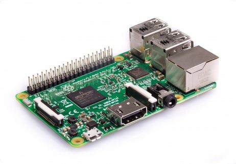

= Raspberry Pi (https://www.raspberrypi.org/)

= Le matériel

[#img-RaspberryPiModeleBRev2]
.Un Raspberry Pi Modèle B Rev 2

[#img-RaspberryPi3ModeleB]
.Un Raspberry Pi 3 Modèle B
[link=https://www.raspberrypi.org/products/raspberry-pi-3-model-b/]

[#img-MicroSD8GB]
.Une carte Micro SD (8GB minimum)

[#img-AlimentationMicroUSB]
.Une alimentation micro USB (2A)

[#img-EthernetCable]
.Un cable Ethernet

Un Raspberry Pi 1 Modèle B Rev 2 +
cat /proc/cpuinfo => Le numéro de Revision donne le type de Raspberry Pi +
cat /proc/device-tree/model => donne directement le type de Raspberry Pi +
https://www.raspberrypi-spy.co.uk/2012/09/checking-your-raspberry-pi-board-version/ +

Une carte SD (8GB minimum) +
https://www.raspberrypi.org/help/faqs/#topSdCards

Un alimentation micro USB (1.2A recommandé) +
https://www.raspberrypi.org/help/faqs/#topPower

Un cable Ethernet

= Installer un système d'exploitation (Raspbian)

Pour mon installation, j'ai utilisé une carte SD de 16GB de classe 10 (30MB/s).

Je suis parti sur l'installation d'une Raspbian (Le système d'exploitation officiel des Raspberry Pi basé sur Debian).
A la date de mon installation (28 octobre 2017), la version disponible était la Raspbian Stretch Lite. +
https://www.raspberrypi.org/downloads/raspbian/

J'ai fait mon installation à partir d'une ubuntu 17.10.

//https://www.raspberrypi.org/documentation/installation/installing-images/linux.md

== Identifier le point de montage de la carte SD et la démonter

* Exécuter la commande df -h pour voir la liste des périphériques montés

* Exécuter la commande umount /dev/sdb1 puis umount /dev/sdb2

== Copier l'image sur la carte SD

* Exécuter la commande dd bs=4M if={chemin du fichier image (.img)} of={chemin de la carte SD /dev/sdX} status=progress conv=fsync

* Créer un fichier ssh sur la partition root de la carte SD (le serveur SSH est désactivé par défaut)
https://www.raspberrypi.org/documentation/remote-access/ssh/

= Supprimez l'utilisateur par défaut ('pi') de votre Raspberry Pi

Se connecter au Raspberry Pi avec l'utilisateur pi

* Exécuter la commande useradd --password $(openssl passwd -1 MyPassword) --groups sudo --create-home --shell /bin/bash biguser

* Exécuter la commande echo "biguser ALL=(ALL) NOPASSWD: ALL" > /etc/sudoers.d/010_biguser-nopasswd

Se connecter au Raspberry Pi avec l'utilisateur biguser

* Exécuter la commande userdel -r pi

* Exécuter la commande rm /etc/sudoers.d/010_pi-nopasswd

= Changer le port SSH sur le Raspberry Pi

* Editer le fichier /etc/ssh/sshd_config

* Modifier la ligne #Port 22 pour remplacer le port 22 (port par défaut) par un autre numéro de port (de préférence entre 1000 et 65535)

* Relancer le service ssh en exécutant la commande sudo service ssh restart

= Installer Fail2Ban pour interdire les tentatives de force brute sur notre Raspberry Pi

* Exécuter la commande sudo apt update

* Exécuter la commande sudo apt install fail2ban

* Créer le fichier /etc/fail2ban/jail.local avec le contenu ci-dessous: +
[DEFAULT] +
ignoreip = 127.0.0.1 192.168.1.138 +
findtime = 3600 +
bantime = 86400 +
 +
[ssh] +
 +
enabled = true +
port = ssh +
filter = sshd +
logpath = /var/log/auth.log +
banaction = iptables-allports +
maxretry = 3

* Exécuter la commande sudo service fail2ban restart

= Sources

https://www.raspberrypi.org/ +
https://www.raspberrypi-spy.co.uk/2012/09/checking-your-raspberry-pi-board-version/ +
https://www.raspberrypi.org/help/faqs/#topSdCards +
https://www.raspberrypi.org/help/faqs/#topPower +
https://www.raspberrypi.org/downloads/raspbian/ +
https://www.raspberrypi.org/documentation/installation/installing-images/linux.md +
http://kamilslab.com/2017/01/29/5-best-basic-security-tips-and-tricks-every-raspberry-pi-user-needs-to-take/ +
https://guide.ubuntu-fr.org/server/user-management.html
https://doc.ubuntu-fr.org/fail2ban
http://kamilslab.com/2016/12/18/3-steps-to-take-to-improve-the-security-of-your-raspberry-pi-server/
